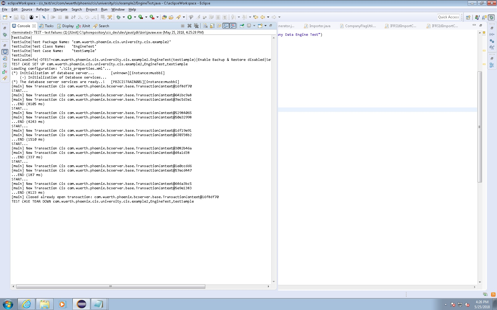

-----------
WP example2
-----------

## 0 How To Run

### Task 1:
run `src.test\allTests.java` from inside the Folder 'Project 1'

### Task 2:
run  `com.wuerth.phoenix.cis.university.example2.test.lemon\MyMainProgram.java` from inside folder  'Project 2'
No actual testing can be done outside of company, but it creates all the combination files in the directory `C:\phxrepository\cis_dev\dev\bin`, as specified by WP. For local test (creation of the combination files) you can change the code line (the same for combinations 2,3,4,5, and 6)

```java
		
settings1.setFilePath("C:\\phxrepository\\cis_dev\\dev\\bin\\lemon_comb1.csv");

```

to the code lines

```java
 
settings1.setFilePath(dirPath + "/" + "lemon_comb1.csv");

```

## 1 Team 

The Lemon team consisted of Lucia Eve Berger, Giorgi Gabunia and Manuel Zambelli. 


## 2 Activities Performed 

### Task 1: 
In Task One, we created a parameterized test suite to run the tests to create all combinations. We used the different csv files (CRComponent, ProfitCenter, Account) to make `List<ArrayList<String>>` which was later used as a hashset for the String inputs (unique). These objects were combined to make all the relevant combinations (as sourced from the documentation).

For the boolean combinations, we recursively combined the size of the possibilities and made a matrix of possible inputs {true, true, false} etc.

The final object was all of the inputs added to `AggregatedTestData instance = new AggregatedTestData(testComp, testprCen, testCR, isExternal, scenarioType,tempAcc, "test", "EU");` which was our new object that was tested by the parameterized test. We decided to make a new combination object to avoid instantiating each object separately at each iteration.
The AggregatedTestData was then injected into the parameterized JUnit, with each the pairwise {Object,TRUE}. TRUE is the "predicted result" of the `isValid` method.

### Task 2:
We developed our code based predominately on the documentation provided by Würth Phoenix. Rather than relying on the provided sample for generation, we dove into the explanation of the combinations. Respectively, we formulated the most efficient way to generate these. This approach was unique. 

### First Steps
We first experimented with using an csv file as a reference sheet. As we had done in the first example, it was served as "database" of possible values. However, as our approach evolved to a more substitution based testing strategy, we used a HashMap for ease of access and manipulation.

This approach was beneficial as we natively implemented the Combinations. Instead of blindly running the combinations through a loop or many loops which could cause performance issues, we analyzed the matrix of possibilities. We found patterns and selected the three HashMaps to easily access and manipulate the key-value pairs.


## 3 Testing Strategies & Code Explanation
### Task 1: 
We use two-pairwise combinations, combining the columns together. For this reason, we removed the `AccountIDS` which will be reintroduced later with `CombinationCreator`. Our focus was on automated reduction.
 
We created an arraylist of `aggregatedData` which contained the unique combinations. The object created are real data. Our testing strategy is based on parameterized, which allows us to add objects easily to be new test cases without having to modify the code. We can simply update the csv or source-of-truth. For example, if a new account combination were added to the "database" or csv, it would be reflected on the final `aggregatedData` object.


### Task 2: 
We use HashMaps to create the base Objects for the possible Combinations. The Hashmaps were lookup dictionaries of three types, the correct values, the incorrect values and the empty values. 

The correct-value HashMap `FillHashMap(correct, "Abc","14-05-2018","1.2","8999");`

The incorrect-value HashMap `FillHashMap(incorrect, tooLong,"05-14-2018","Abc","100");` 

The empty-value HashMap `FillHashMap(empty,"","","","");`.


Using the correct HashMap, an initial `combinationVariables` is created. We use these HashMaps as our source of truth as we avoided manual inputs. (`CombinationValues.java`)
Following the documentation directly, we separated each combination in its own method. Each combination was mostly independent, with slight overlap over `ContractNumber` and other general parameters. Overall, specific combination values were unique to their method.

### Code Implementation:

### Combination 1: 

`addCombination1()`

The first combination was most straightforward as we used substitution to introduce one incorrect and one empty for each parameter of interest(`IFRS16ImportAssignmentType`). We used a loop for each `IFRS16ImportAssignmentType` taking an incorrect and empty to generate the full table of values (from WP documentation).


### Combination 2, 3, 5, 6: 

`addCombination2(), addCombination3(), addCombination5(),  addCombination6()`

We employed a similar approach as Combination1 for 2,3,5 and 6. We needed to create an separate Object or Objects in each method as an input value(s). Instead of creating a new object at each iteration, we create the correct instance and used it throughout.

For example, 
`ConcreteAccount concrAcc = new ConcreteAccount(Constants.IFRS16_RIGHT_OF_USE_LAND_AND_BUILDINGS);`

### Combination 4: 
In Combination 4, we create all possible permutations of the values. We needed to write each instance explicitly. The resulting method is a bit clunky but unfortunately, there was not a more clever way to shorten the implementation. Our approach was efficient for 5 of the 6 methods so we kept it. 

## 4 Initial Combinations & Reductions
### Task1
Initial combinations were created considering only the Account information ("Account.csv"). The reduction strategy consisted in alternating the Partner allowed flag ("true" for odd combination lines and "false" for even combination lines). We then manually added also information from the other files ("CRComponent.csv" and "ProfitCenter.csv") obtaining 85 combination lines stored in the file "all_input.csv" (this file is in the `data` folder). For the last step the combination lines were automatically created considering information from the different fields accounts, cr components and profit center. Also the domain knowledge was important.
### Task2
The Reduction files are in the `backup` directory which includes the samples used in the GUI tests. These six files are generated when run in the company and contain respectively 19, 84, 3, 9, 9, and 480 combination lines. This task is performed by the class `EngineTestData` (`addCombination` methods).


## 5 Challenges  you faced and the solutions you performed
1. Scope: For both exercises, we struggled with the scope of the task. As much of the code was specific to the company, at times it was challenging to understand whether we should be finding error combinations or an exhaustive sweep. We solved this by going to the company and injecting our final csv into their GUI reader. After we had seen an example of how the input was read, it was much easier to understand the expectations of us. 
2. Setting Parameters: In our debugging/testing at the company, we discovered missing Setting Parameters in our implementation. Upon conferring with an employee, we fixed the defaults and ran our code with great success. We consider this a valuable learning experience as relying solely on documentation can be dangerous. It also solidified the value of domain knowledge and expert consultations.
3. Time Constraints: Working in a short time period made us more cognizant of what tasks we ran while at WP. We also tried to prepare the code in advanced before the project sessions.

## 6 Highlight the code snippets that show your best contribution to the project

### Task 1: 

### CSV reader 
The below code injects the csv files into component lists. It considers the information after the first (header) line. For the the file "Account.csv" the two columns of the component list are the Account class and the Account type. The Partner allowed flag is automatically alternately set true and false in the class `CombinationCreator`.
```java
    public static List<ArrayList<String>> createComponentLists(String string_path){
	Path path = Paths.get(FileSystems.getDefault().getPath("").toAbsolutePath().toString(), string_path);
	String csvFile = path.toString();
	BufferedReader br = null;
	String line = "";
	String cvsSplitBy = ",";
	int columnCount=0;
	boolean isHeader = true;
	List<ArrayList<String>> csvList = new ArrayList<ArrayList<String>>();
	try {
		br = new BufferedReader(new FileReader(csvFile));
        Set<String> column1 = new HashSet<String>();
        Set<String> column2 = new HashSet<String>();
        while((line=br.readLine())!=null){
        {
	        	if (isHeader) {
					isHeader = false;
					continue;
			}
            String[] linePieces = line.split(cvsSplitBy);
            columnCount = linePieces.length;
            // can we do this?
            if (string_path.contains("Account")) {
	            	column1.add(linePieces[1]);
	            column2.add(linePieces[2]);
            }
            else {
            linePieces[0]=linePieces[0].replaceAll("[*0-9]", "");
            column1.add(linePieces[0]);
            }
        }
        }
        if (string_path.contains("Account")) {
        		csvList=generateAccountData(column1, column2);
        }
        else {
        		csvList = generateGenericData(column1, columnCount, string_path);  
        }
        br.close();
        return csvList;
````
The Component lists are instantiated from each of the files and then combinations are pulled from their unique values.

```java		
	
	List<ArrayList<String>> crComponents = createComponentLists("data/CRComponent.csv");
	List<ArrayList<String>> profit_center = createComponentLists("data/ProfitCenter.csv");
	List<ArrayList<String>> accounts = createComponentLists("data/Account.csv");	

```
### Parameterized 
Firstly, the list with the combinations called combinedDataList is created by the method `create_test_data()` of the class `CombinationCreator`, which aggregates the information taken from the csv files "Account", "CRComponent" and "ProfitCenter". That list is then transformed to a 2-dimensional array where the second column is set to the predicted outcomes (always "true").
```java 
    @RunWith(Parameterized.class)
    public class AccountValidityTest {
	static List<AggregatedTestData> combinedDataList= new ArrayList <AggregatedTestData>();
	@Parameters
	public static Collection<Object[]> data() {
		CombinationCreator Creator = new CombinationCreator();
		combinedDataList = (List<AggregatedTestData>) Creator.create_test_data();
		Object[][]objArray = new Object[combinedDataList.size()][2];
		for (int i=0; i<combinedDataList.size(); i++) {
			objArray[i][0]=combinedDataList.toArray()[i];
			objArray[i][1] = true;
		}
			return Arrays.asList(objArray);
	}
```

### Run Parameterized (class `AccountValidityTest.java`)
This class uses the combined data list created by the `CombinationCreator` class completed with the predicted outcome. That whole row (called `testDataRow`) is used as input for the method "Example1Checker" by the company.
```java 

	public static void tearDown() throws Exception {
	}
	
    private AggregatedTestData testDataRow;
	
    private boolean predictedOutcome;
	
	public AccountValidityTest(AggregatedTestData testAccount, boolean predictedOutcome) {
		this.testDataRow = testAccount;
		this.predictedOutcome = predictedOutcome;
	}
	
	@Test
	public void testAccountInputs() {
			try {
				System.out.println(testDataRow.getAccount());
				boolean res = Example1Checker.isValid(testDataRow.getCompany(), testDataRow.getProfitCenter(), testDataRow.getCrComponent(), testDataRow.isExternal(), testDataRow.getScenarioType(),testDataRow.getAccount(), testDataRow.getPartnerCode(), testDataRow.getCurrencyCode());
				assertEqual(res, predictedOutcome);
				}
			catch(Exception e) {
					System.out.println(e);
				}
		}

		private void assertEqual(boolean res, boolean isValid2) {
		
	}

}
```


### Task 2: 

### Hashmaps (class `CombinationValues.java`)
We provided three hashmaps (one for correct values, one for incorrect values, and one for empty values). The following method `FillHashMap` fills the specified hashmap with the given input values, e.g. for the contract number, for the start of the contract, for the from date, etc. 
```java 
	private void FillHashMap(HashMap<String, CombinationItem<?>> hmap, String genericString, Long genericDate, Double genericDouble, String companyCode) {
		CombinationItem<String> iContractNumber = CombinationItem.getNewCombinationItem(genericString);
		hmap.put("ContractNumber", iContractNumber);
		// adds many similar combinations
		CombinationItem<Long> iFromDate = CombinationItem.getNewCombinationItem(genericDate,settings);
		hmap.put("FromDate", iFromDate);
		hmap.put("AmountWithoutValueAddedTax", iAmountWithoutValueAddedTax);
		CombinationItem<Long> iUntilDate = CombinationItem.getNewCombinationItem(genericDate,settings);
		hmap.put("UntilDate", iUntilDate);
	
	}
```

### Querying the hashmaps (class `CombinationValues.java`)
The following methods are used to return correct, incorrect and empty values. For incorrect and empty values we use the correct values, some of which are replaced with empty and incorrect values corresponding to a given key (the methods are called by the combination creation methods in the `EngineTestData` class, where also the keys are specified).  
```java 
    public HashMap<String, CombinationItem<?>> getCorrectValues() {
		return (HashMap<String, CombinationItem<?>>) correct.clone();
	}
	public HashMap<String, CombinationItem<?>> getInCorrectValues(String key) {
		HashMap<String, CombinationItem<?>> result = (HashMap<String, CombinationItem<?>>) correct.clone();
		CombinationItem<?> swapped = incorrect.get(key);
		result.put(key,swapped);
		return result;
	} 
	public HashMap<String, CombinationItem<?>> getEmptyValues(String key) {
		HashMap<String, CombinationItem<?>> result = (HashMap<String, CombinationItem<?>>) correct.clone();
		CombinationItem<?> swapped = empty.get(key);
		result.put(key,swapped);
		return result;
	} 
```

### Settings Generator (class `CombinationValues.java`)
The following method `getSettings()` is called by the constructor for the class `EngineTestData` and is used to set the basic configuration required for the company's import checker. That configuration comprises the locale setting ("de" or "en"), the chosen digit grouping symbol (comma or point), the date format, etc.
```java 
	private Settings getSettings() {
		Locale currentLocale = new Locale("de");
		DigitGroupingSymbol digitGroupingSymbol = DigitGroupingSymbol.COMMA;
		DigitGroupingSymbol decimalSeparator = DigitGroupingSymbol.POINT;
		String dateFormat = "dd-MM-yyyy";
		Settings settings = new Settings(currentLocale, digitGroupingSymbol, decimalSeparator, dateFormat);
		settings.setLongVersion(true);
		settings.setAcceptOrders(true);
		settings.setYear(YEAR);
		settings.setMonth(MONTH);
		return settings;
	}
```

### For loop logic (class `EngineTestData.java`)
The following for loop is part of the different `EngineTestData` class methods `addCombination1()`, `addCombination2()`, and `addCombination6()`, which respectively create the combinations 1, 2, and 6 according to the document "Reduction.docx". The purpose is to create combination lines with correct, incorrect and empty values.
```java 
for (String parameter : combinationVariables) {
		currentValues.clear();
		combinationLine = new CombinationLine();
		HashMap<String, CombinationItem<?>> inCorrectValues = cv.getInCorrectValues(parameter);
		HashMap<String, CombinationItem<?>> emptyValues = cv.getEmptyValues(parameter);
```

## 7 Results & Reflections
### Test execution for task1
Screenshot of the JUnit Test in Eclipse (run with `allTests.java` in the `test` package).

 
### Test execution Wuerth Phoenix 2018-05-25

### Part 1: Speed Execution Results:


| Test run  | Elapsed time (sec) |
| --------- | ------------------ |
|  Nr. 1    |         46.023     |
|  Nr. 2    |          44.183    |
|  Nr. 3    |           51.950   |
|  Nr. 4    |   52.365           |
|  Nr. 5    |        53.352      |
|  Nr. 6    |      53.110        |
|  Nr. 7    |        50.441      |
|  Nr. 8    |           48.368   |
|  Nr. 9    |              48.914|
|  Nr.10    |           52.661   |


 
### Figure 1: 
Screenshot of the running code, with the output combinations.



### Figure 2:
Screenshot of the import file.


### Part 2: GUI Testing 

After timing the speed of our combination generating code, we conducted the GUI testing with the random input combination variables. To run this test, we passed a different `@RunWithAnnotation`. 
On our first run, we got 3 input combinations then a failure. Following this, we regenerate another random inputs and got up to 8 input combinations. 
On a third run, we got 12 input combinations passed then failed. Unfortunately, we did not have enough time to reach the 20 passing input combinations. 

### Part 3: Coverage test

### Coverage test

| Module      | Coverage |
| ----------- | -------- |
| Data Engine |   94.6%  |
| Data Merger |   84.4%  |
| Data Parser |   95.9%  |


### Reflections

After testing our project on site, we realized several important lessons. 

1. Working under a deadline: We learned how to test and work under pressure, utilizing the company resources we had. 

2. JUnit: In both exercises, JUnit was an invaluable tool that sped our development. It also allowed us to comply with exercise restrictions, such as complete testing running under 60s.

3. Domain knowledge: The WP employees were able to validate our design quickly as well as answer our questions based on their immense knowledge of the subject (more than 10 years on the project). For example, they knew the correct Annotations for each of the tests, including the GUI test at the end. We also appreciated their feedback as documentation alone is not enough to fill specifications.


